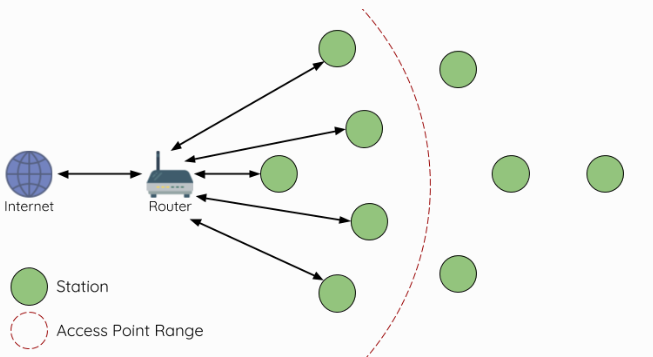
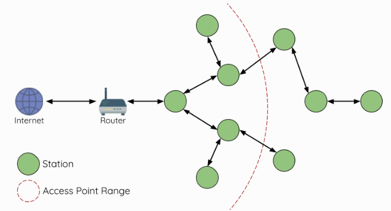
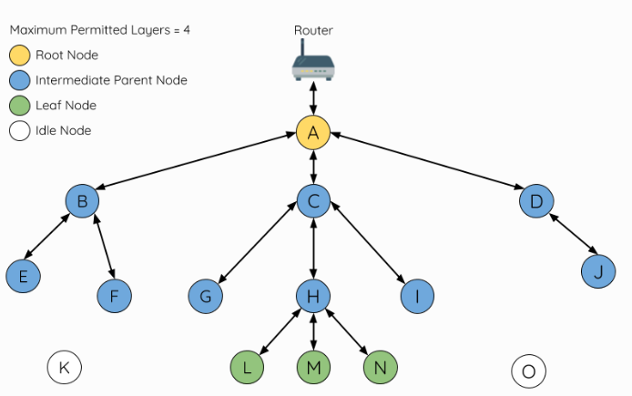
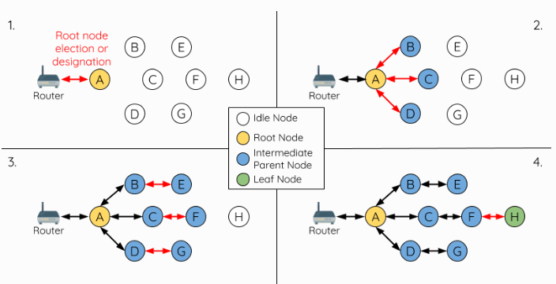

## Mesh Concept

A mesh network is a type of network topology where devices, called nodes, are interconnected, allowing data to be transmitted between them even if some nodes are out of direct range of each other. This creates a robust and self-healing network where data can take multiple paths to reach its destination, enhancing reliability and coverage.

In a mesh network, each node (such as an ESP32) can both send and receive data, effectively acting as a repeater. This decentralized approach contrasts with traditional star networks, where communication is routed through a central hub.

The use of ESP32 microcontrollers in mesh networks is particularly effective due to their low power consumption, Wi-Fi capabilities, and flexibility in handling communication protocols. By leveraging ESP32 devices, you can create a scalable and resilient mesh network suitable for applications like home automation, IoT, and remote sensing.

### Types of Mesh Networks

#### BLE Mesh
Bluetooth Low Energy (BLE) Mesh is a wireless communication standard designed for low-power devices to create a mesh network. BLE Mesh allows devices to communicate with each other over relatively short distances, typically up to 100 meters, by relaying messages through intermediate nodes. It's optimized for scenarios where low power consumption is crucial, such as smart lighting, industrial IoT, and home automation. BLE Mesh networks are highly scalable, supporting thousands of nodes, and are commonly used in environments where devices need to communicate with each other without requiring high data rates.

#### Wi-Fi Mesh
Wi-Fi Mesh is a network topology where multiple Wi-Fi access points (nodes) work together to provide seamless and extended wireless coverage over a larger area. In a Wi-Fi Mesh network, each node communicates with its neighboring nodes, allowing devices to connect to the strongest signal available. This ensures consistent and reliable connectivity across different parts of a home, office, or larger space. Wi-Fi Mesh networks are typically used to eliminate dead zones and improve network coverage and speed. They are ideal for applications requiring high data throughput, such as streaming, online gaming, and handling large amounts of data.

|                    | BLE Mesh                                                                                                                                        | Wi-Fi Mesh                                                                                                                 |
|--------------------|-------------------------------------------------------------------------------------------------------------------------------------------------|----------------------------------------------------------------------------------------------------------------------------|
| Range and Coverage | Typically covers shorter distances (up to 100 meters per hop), suitable for low-power, short-range applications.                                | Offers broader coverage over larger areas, with nodes typically placed farther apart.                                      |
| Power Consumption  | Optimized for low power consumption, making it ideal for battery-operated devices and scenarios where energy efficiency is critical.            | Generally consumes more power, suitable for applications where devices are typically connected to a power source.          |
| Data Rate          | Supports lower data rates, sufficient for simple control commands, sensor data, and small amounts of information.                               | Supports higher data rates, enabling faster data transfer and handling more bandwidth-intensive tasks.                     |
| Applications       | Commonly used in smart homes, wearables, industrial IoT, and other environments where low power and low data rate communication are sufficient. | Used in residential, commercial, and enterprise environments where consistent, high-speed internet connectivity is needed. |
| Scalability        | Can support thousands of nodes in a network due to its efficient communication protocol.                                                        | Typically involves fewer nodes, as each node is more powerful and covers a larger area.                                    |

### Traditional Wi-Fi Network Architecture

    

A traditional infrastructure Wi-Fi network operates as a point-to-multipoint system where a central node, called the access point (AP), directly connects to all other nodes, known as stations. The AP manages and forwards transmissions between these stations, and in some cases, it also handles communication with an external IP network through a router. However, this type of Wi-Fi network has the drawback of limited coverage, as each station must be within range of the AP to connect. Additionally, traditional Wi-Fi networks can become overloaded since the number of stations that can connect is restricted by the AP's capacity.

### ESP Wi-Fi Mesh

    

ESP-WIFI-MESH differs from traditional infrastructure Wi-Fi networks by eliminating the need for nodes to connect to a central node. Instead, nodes can connect with neighboring nodes, with each node sharing the responsibility of relaying transmissions. This design enables an ESP-WIFI-MESH network to cover a much larger area since nodes can remain interconnected even when they are out of range of a central node. Additionally, ESP-WIFI-MESH is less prone to overloading because the number of nodes on the network is not constrained by the capacity of a single central node.

### Node Types

    

#### Root Node
The root node is the highest node in a Wi-Fi mesh network and acts as the sole interface between the mesh network and an external IP network. It connects to a conventional Wi-Fi router and is responsible for relaying packets between the external IP network and the nodes within the mesh network. There can only be one root node in a Wi-Fi mesh network, and its only upstream connection is to the router. In the diagram above, node A is the root node of the network.

#### Leaf Nodes
A leaf node is a node that cannot have any child nodes (no downstream connections). It can only send or receive its own packets and cannot forward packets from other nodes. A node is designated as a leaf node if it is located at the network’s maximum allowed layer, preventing it from creating downstream connections and thus avoiding the addition of an extra layer to the network. Additionally, nodes without a softAP interface (station-only nodes) are assigned as leaf nodes, as a softAP interface is required for downstream connections. In the diagram above, nodes L, M, and N are positioned at the network's maximum layer and are therefore designated as leaf nodes.

#### Intermediate Parent Nodes
Nodes that are neither the root node nor leaf nodes are considered intermediate parent nodes. An intermediate parent node must have one upstream connection (one parent node) and can have zero to multiple downstream connections (zero to multiple child nodes). These nodes can transmit and receive packets as well as forward packets from their upstream and downstream connections. In the diagram above, nodes B to J are intermediate parent nodes. Intermediate parent nodes without downstream connections, such as nodes E, F, G, I, and J, differ from leaf nodes because they can still form downstream connections in the future.

#### Idle Nodes
Nodes that have not yet joined the network are classified as idle nodes. These nodes will try to establish an upstream connection with an intermediate parent node or attempt to become the root node under certain conditions (see Automatic Root Node Selection). In the diagram above, nodes K and O are idle nodes.

### Building a Mesh Network

    

The process of building a Wi-Fi mesh network involves first selecting a root node, followed by establishing downstream connections layer by layer until all nodes have joined the network. The specific structure of the network may vary based on factors such as root node selection, parent node selection, and asynchronous power-on reset. However, the Wi-Fi mesh network building process can generally be summarized in the following steps:

#### 1. Root Node Selection
The root node can either be designated during the configuration process (see the section on User Designated Root Node) or dynamically elected based on the signal strength between each node and the router (see Automatic Root Node Selection). Once the root node is selected, it connects to the router and begins facilitating downstream connections. In the figure above, node A is chosen as the root node and forms an upstream connection with the router.

#### 2. Second Layer Formation
After the root node connects to the router, idle nodes within range of the root node begin connecting to it, creating the second layer of the network. These second-layer nodes become intermediate parent nodes (assuming the maximum permitted layers exceed two), enabling the formation of the next layer. In the figure above, nodes B to D are within range of the root node, so they connect to it and become intermediate parent nodes.

#### 3. Formation of Remaining Layers
The remaining idle nodes connect with nearby intermediate parent nodes, forming new layers within the network. Upon connection, these idle nodes become either intermediate parent nodes or leaf nodes, depending on the network’s maximum permitted layers. This process repeats until all idle nodes have joined the network or the maximum layer depth has been reached. In the figure above, nodes E, F, and G connect to nodes B, C, and D respectively, becoming intermediate parent nodes themselves.

#### 4. Limiting Tree Depth
To ensure the network does not exceed the maximum allowed number of layers, nodes at the maximum layer automatically become leaf nodes once they connect. This prevents any further idle nodes from connecting to these leaf nodes, thereby preventing the formation of an additional layer. If an idle node cannot find a suitable parent node, it will remain idle indefinitely. In the figure above, the network’s maximum permitted layers are set to four, so when node H connects, it becomes a leaf node to prevent any further downstream connections.